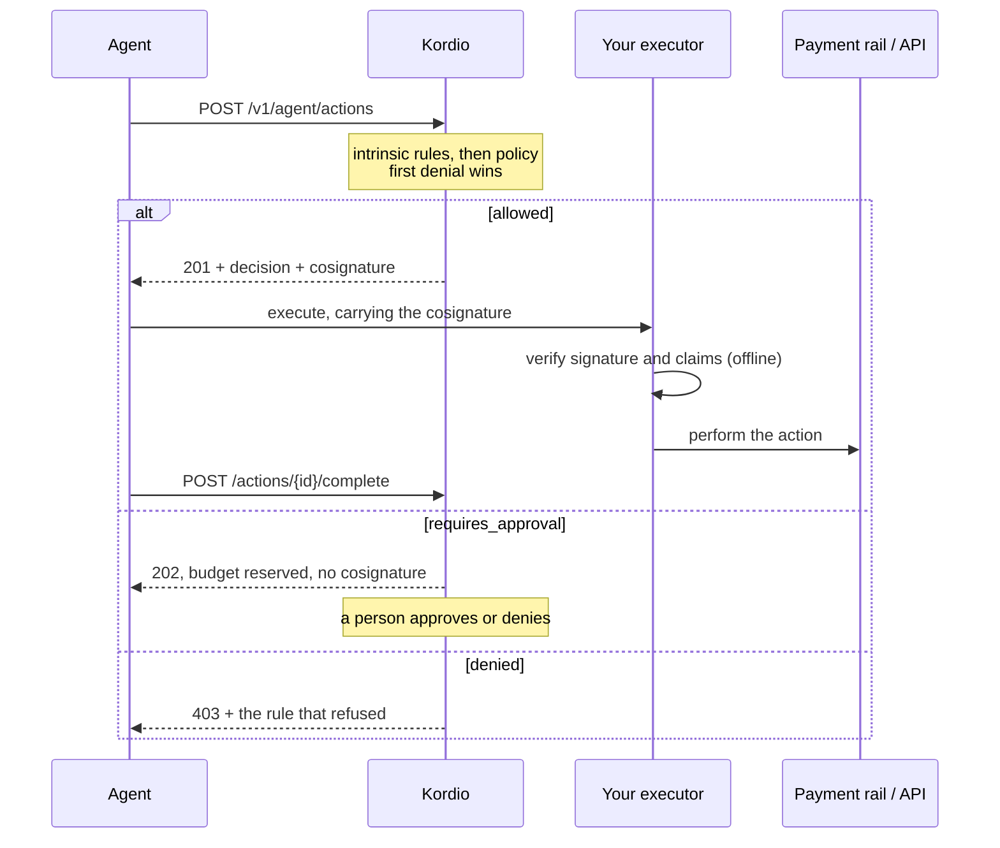

Spend control answers one question, the same way for a payment, a paid tool call, or anything
else: may this runtime take this action, right now? This page is what happens between the
request and the answer.

## The shape of the flow

The executor verifying the cosignature is the part that makes this enforcement rather than
advice. A decision stored only in our database binds an executor that chooses to ask us, every
time. A signature binds anything that checks it.

## Evaluation order

Three **intrinsic rules** always run first. They cannot be disabled and they are not part of
any policy you write:

1. `session_inactive`: the session must be `active`.
2. `runtime_scope`: the runtime's key must be scoped for this action type.
3. `session_budget`: the spend must fit the remaining session budget.

Then the rules compiled from each active policy run, oldest policy first, with imported
modules compiled in ahead of a policy's own rules.

**The first denial wins**, immediately. An approval requirement only stands if nothing denies.
That ordering matters: a rule that would hold something for a human never overrides a rule that
refuses it outright.

<Warning>
  **A runtime with no active policy denies everything**, with the rule `no_policy`. The
  intrinsic rules do not count as a policy. This is fail-closed by design: a runtime nobody has
  written rules for has no authority rather than unlimited authority. It is also the most common
  surprise in a first integration.
</Warning>

An `allowlist`-mode policy that matched no `allow` rule denies with `not_allowlisted`. Each
allowlist policy is an independent gate, so attaching two means both must be satisfied.

## Outcomes and states are different vocabularies

Two fields describe adjacent facts and they overlap without meaning the same thing.
`decision.outcome` is what the policy engine answered. `data.state` is where the intent sits in
its lifecycle.

| `decision.outcome` | Status | Resulting `state` | What it means |
| --- | --- | --- | --- |
| `allowed` | `201` | `pending` (actions), `executed` (payments) | Authority granted. |
| `requires_approval` | `202` | `requires_approval` | Parked for a person. Budget reserved. |
| `denied` | `403` | `denied` | Refused. Nothing reserved. |

An action then leaves `pending` only when you report the outcome: `completed` or `failed`. So
`requires_approval` and `denied` appear in both vocabularies and mean the same thing; every
other value belongs to one or the other.

Full state sets:

- Action intent: `pending`, `requires_approval`, `completed`, `failed`, `denied`.
- Payment intent: `pending`, `requires_approval`, `executed`, `settled`, `failed`, `denied`.

## Why a session and not just a cap

A per-transaction cap stops one big mistake. It does nothing about the same reasonable-looking
action happening nineteen times.

A session is the answer to that. You open one per run with a budget, every authorized action
commits against it, and the budget is what a loop runs into. Reservations are held while an
action is pending or waiting on a person, and released when it fails or is denied, so a crashed
agent does not strand its budget forever.

Budget is claimed with a single conditional update rather than a lock, so parallel sub-agents
under one runtime contend at the row instead of queueing behind each other.

## Headroom

Every decision carries `headroom`, reporting what is left on each limit that applied, reduced
to the tightest value per key.

Give it to your agent. An agent that knows it has $380 left on the session picks a cheaper
vendor; an agent that only knows it was refused retries into the same wall.

## Payments are not actions

`POST /v1/agent/payment_intents` is a separate resource from `POST /v1/agent/actions`, and it
differs in three ways that will bite you if you assume symmetry.

| | `/v1/agent/actions` | `/v1/agent/payment_intents` |
| --- | --- | --- |
| Idempotency | `Idempotency-Key` **header**, missing is `422` | `idempotency_key` **body field**, missing is `400` |
| On `allowed` | `state: pending`, you execute | Executed in-request, `state: executed` or `failed` |
| Reporting | You must call `complete` or `fail` | Nothing to report |

A payment is still evaluated as the action type `payment.create` with the counterparty as its
resource, so a runtime's caps, windows and allowlists apply across payments and other actions
together. Spend on one consumes headroom for the other.

## Test and live

A runtime is `test` or `live`. Both run the same engine, evaluate the same policies, and return
the same shapes, including cosignatures. The difference is that live runtimes authorize real
money and require a paid plan.

You can therefore prove the entire integration, including cosignature verification inside your
own executor, before anything is at stake.

## Next steps

<CardGroup cols={2}>
  <Card title="Writing a policy" icon="scale" href="/agents/policies">
    Every rule kind, and the condition language.
  </Card>
  <Card title="Holding spend for a person" icon="user-check" href="/agents/approvals">
    What a `202` means and how it resolves.
  </Card>
  <Card title="What Kordio guarantees" icon="lock" href="/agents/guarantees">
    The properties this ordering is meant to give you.
  </Card>
  <Card title="Where the ledger fits" icon="book-open" href="/agents/ledger-projection">
    How decisions become balanced postings.
  </Card>
</CardGroup>
