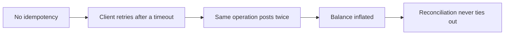

Most systems store state and hope it stays correct. A ledger inverts that. It is built so that incorrect states cannot be represented in the first place. Each invariant on this page is not a guideline we try to honor. It is a constraint that makes a specific kind of money corruption impossible, so that when the invariant holds, the meaning of every balance stays unambiguous.

Read each one as a guarantee followed by the failure it removes: the bug class that becomes possible the moment the invariant does not hold. Infrastructure is judged on its failure modes, not its definitions, so that is how this page is written.

## The root invariant: the ledger is always replayable

There is one principle underneath all the others. The postings are the only source of truth, and every balance, statement, and report is a deterministic function of them. State is never authoritative on its own. It can always be thrown away and reconstructed by replaying the postings, and the reconstruction is always identical.

If that holds, you can always answer "is this number real?" by recomputing it from the entries. Every other invariant on this page exists to keep the log clean enough that the replay is always exact: the entries must be immutable (so the past does not move), value must be conserved (so the total is meaningful), writes must be atomic and idempotent (so the log has no torn or duplicated entries), and history must be deterministic (so two replays agree). Lose replayability and the ledger stops being a system of record and becomes just another database you have to trust.

The invariants below are grouped by what they protect: the shape of the log, the conservation of value, the way writes happen, and the ability to reconstruct and reconcile.

## Structural invariants: the shape of the log

These keep the log itself well-formed, so that what you replay is the same thing that was written.

### Entries are immutable and append-only

A posting's economic meaning never changes once written. You correct by appending a reversal or refund that references the original, never by editing it. The economic columns (`amount`, `direction`, `currency`, `account_id`) are frozen by a `BEFORE UPDATE` trigger; only a commit-pending flag and the reconciliation fields may ever change.

**What breaks if it fails:** the past becomes editable. An audit can no longer trust that an entry says today what it said when it was written, a dispute has no fixed record to point at, and replay produces a different history every time you run it. Append-only is what makes the log a record rather than a guess.

### Live and test data never interleave

Each OAuth client is bound to one mode, and live and test data are segregated at the storage level. The mode of your token decides which dataset you touch.

**What breaks if it fails:** test traffic contaminates real balances. A load test or a demo could inflate a production total, and you could no longer tell synthetic movements from real ones.

### Amounts are integer minor units, and currency is immutable

Every amount is stored as an exact integer in the currency's smallest unit (cents, satoshis, or the base unit of an 18-decimal token); floats are rejected at the schema. An account's `currency` is set at creation and can never change.

**What breaks if it fails:** floating point reintroduces sub-cent drift that accumulates and never reconciles, and a mutable currency would silently reinterpret every historical posting on the account, changing what past entries mean after the fact.

The same exactness applies on the wire: every monetary field is serialized as a JSON string of
integer minor units — [parse them with a big-integer
type](/ledger/concepts#integer-minor-units).

## Financial invariants: conservation of value

These are the accounting laws. They make value behave like a conserved quantity that can move but cannot appear or vanish.

### Debits equal credits, per currency

Every transaction balances in every currency it touches. Value is only ever moved between accounts, never created or destroyed. This is checked in application code and again by deferred Postgres triggers that fire at `COMMIT`, so a multi-posting transaction is validated as a whole.

**What breaks if it fails:** money is conjured or lost. The trial balance stops summing to zero, no total can be trusted, and you are left unable to prove that the funds you report actually exist.

### Balances are derived, never stored

A balance is a function of the postings beneath it. There is no balance column. A hot account keeps a running total in memory as a cache, but the postings are always the authority; if the cache and the postings ever disagreed, the postings win.

**What breaks if it fails:** a stored balance becomes a second source of truth that can drift from the entries it claims to summarize. You end up with two numbers that disagree and no principled way to say which is real. A derived balance cannot drift, because there is nothing to drift from.

## Execution invariants: how writes happen

These govern the act of writing, so that the log never ends up with a torn, duplicated, or race-corrupted entry.

### Transactions are atomic

A transaction and all of its postings commit together or not at all. The coordinator writes them inside a single database transaction; if any part fails, including the balance check at `COMMIT`, the whole write rolls back.

**What breaks if it fails:** a half-written transaction lands, with some postings present and their counterparties missing. That single torn write violates conservation directly: the ledger no longer balances, and the gap is permanent.

### Operations are idempotent

Each `(ledger_id, idempotency_key)` maps to exactly one transaction forever, enforced by a unique index. A replay returns the original transaction and a replayed marker, and because the database enforces uniqueness, a race between two identical requests still yields exactly one transaction.

**What breaks if it fails:** a retry under failure double-posts. This is the classic duplicate-charge bug: the network times out, the client retries, and the same economic event is recorded twice.

### Writes to an account are serialized

Every active account is served by a single process that serializes the writes to it, so concurrent operations on one account apply in a defined order rather than racing.

**What breaks if it fails:** balance-dependent decisions race. Two concurrent debits could both read a sufficient balance and both succeed, driving a non-negative account below zero. Serialization is what makes "check the balance, then post" safe under concurrency.

## Reconciliation invariants: the log proves itself

These make the ledger auditable: the same data always tells the same story, today and a year from now.

### Replay is deterministic

Recomputing balances and reports from the postings always produces the same result, and the events stream (`GET /v1/events`) is a durable, replayable tail of every state change. This is the root invariant in practice.

**What breaks if it fails:** an audit run today and the same audit run tomorrow over unchanged data disagree. You can report a number but you cannot prove it, which is the one thing a system of record exists to do.

### Point-in-time history is stable

Historical balances and statements are computed from each posting's `value_date`, when the movement is economically effective, not from when the row happened to be inserted. The same question at the same instant always returns the same answer.

**What breaks if it fails:** "what was my balance on March 1" has no stable answer. Restating a period later, or simply inserting a backdated correction, would shift historical balances depending on insertion timing rather than economic date.

## Why this framing matters

Taken together, these are not features you switch on. They are constraints that remove whole categories of failure from the space of things that can happen: no torn writes, no duplicated charges, no drifting balances, no editable history, no value created from nothing, no number you cannot reconstruct. You get to reason about your integration in terms of what the ledger makes impossible, which is a much stronger position than trusting that it usually does the right thing.

<CardGroup cols={2}>
  <Card title="Why not just use Postgres?" icon="database" href="/ledger/why-not-postgres">
    What you would have to build to enforce these invariants yourself.
  </Card>
  <Card title="Money flows" icon="arrow-right-left" href="/ledger/money-flows">
    How value moves through accounts as balanced postings.
  </Card>
  <Card title="Reconciliation" icon="git-compare" href="/ledger/reconciliation">
    The replay and audit invariants put to work.
  </Card>
  <Card title="Core concepts" icon="book" href="/ledger/concepts">
    Double-entry, corrections, idempotency, multi-currency, value dates.
  </Card>
</CardGroup>
