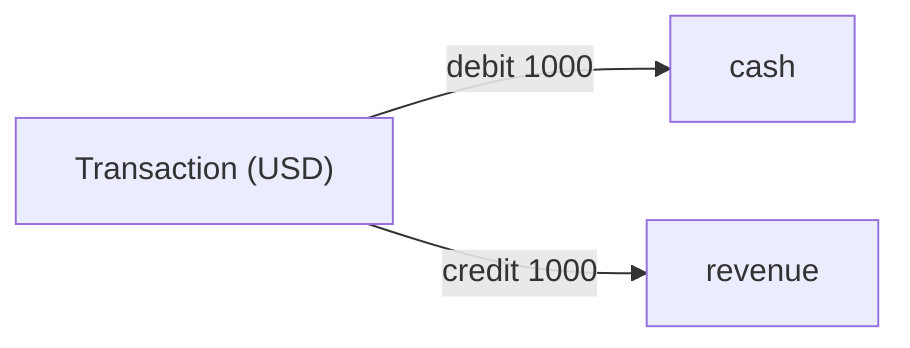
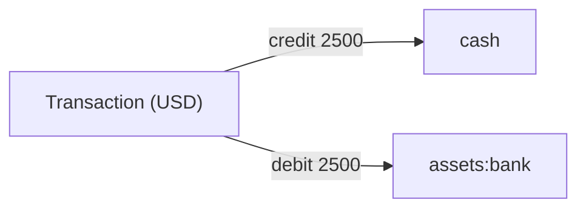
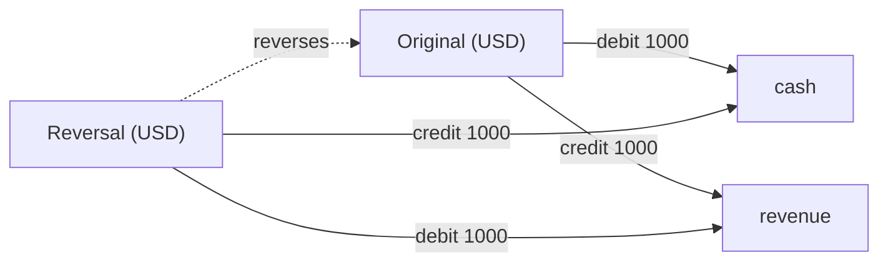
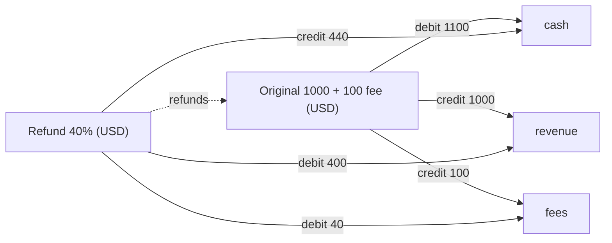
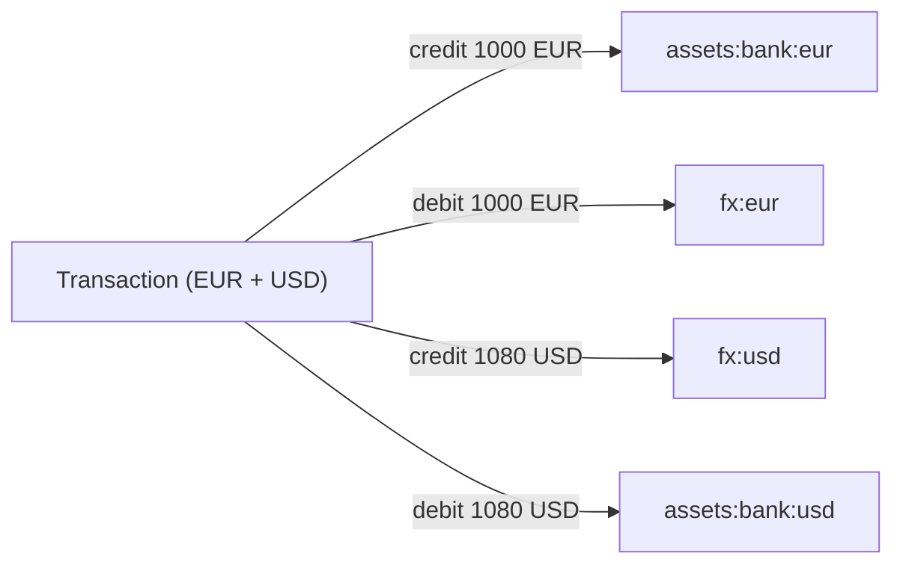

Every movement of value in the ledger is a transaction made of balanced postings. A posting names an `account`, an `amount` in minor units, a `direction` (`debit` or `credit`), and a `currency`. A transaction is valid only when its debits equal its credits in every currency it touches.

The diagrams below trace common shapes. The account ids (`cash`, `revenue`, `assets:bank`, `fees`) are illustrative names you choose; the platform attaches no meaning to them.

<Note>
  Amounts below are written as bare numbers for readability. On the wire every monetary value is
  a JSON string of integer minor units — [parse them with a big-integer
  type](/ledger/concepts#integer-minor-units).
</Note>

## A simple credit into one account

The smallest transaction moves value between exactly two accounts. To record 10.00 USD of revenue, you debit `cash` and credit `revenue`. The amounts are equal, so the transaction balances.

| account | amount | direction | currency |
| --- | --- | --- | --- |
| `cash` | `1000` | `debit` | `USD` |
| `revenue` | `1000` | `credit` | `USD` |

Debits total `1000`, credits total `1000`. The write is accepted.

## A transfer between two accounts

A transfer is the same shape: value leaves one account and lands in another. To move 25.00 USD from `cash` into `assets:bank`, credit the source and debit the destination.

| account | amount | direction | currency |
| --- | --- | --- | --- |
| `cash` | `2500` | `credit` | `USD` |
| `assets:bank` | `2500` | `debit` | `USD` |

The two accounts net out against each other and the transaction balances.

## A reversal

You never edit a transaction to undo it. You append a reversal, which is a new transaction that posts the inverse of every leg and references the original. Reverse the simple credit above with `POST /v1/transactions/{id}/reverse`.

The reversal's postings, the inverse of the original:

| account | amount | direction | currency |
| --- | --- | --- | --- |
| `cash` | `1000` | `credit` | `USD` |
| `revenue` | `1000` | `debit` | `USD` |

After both transactions, the net effect on `cash` and `revenue` is zero. Both transactions remain in history: the reversal links back via `reverses` and the original gains a `reversed_by` pointer.

## A partial refund

A refund offsets part of a transaction. `POST /v1/transactions/{id}/refund` books an inverse for the requested `amount`, scaling each leg proportionally so the result still balances per currency. Refund 4.00 USD of a 10.00 USD transaction that had a 1.00 USD fee.

The refund scales every leg by `400 / 1000` and stays balanced:

| account | amount | direction | currency |
| --- | --- | --- | --- |
| `cash` | `440` | `credit` | `USD` |
| `revenue` | `400` | `debit` | `USD` |
| `fees` | `40` | `debit` | `USD` |

Debits total `440`, credits total `440`. The fee leg is reversed in proportion, so a partial refund never leaves the fee account stranded.

## A multi-currency transaction

A single transaction may touch more than one currency. The balance rule applies independently per currency: debits must equal credits within `USD` and, separately, within `EUR`. Record an FX leg that takes in 1000 minor units of `EUR` and pays out 1080 minor units of `USD`.

| account | amount | direction | currency |
| --- | --- | --- | --- |
| `assets:bank:eur` | `1000` | `credit` | `EUR` |
| `fx:eur` | `1000` | `debit` | `EUR` |
| `fx:usd` | `1080` | `credit` | `USD` |
| `assets:bank:usd` | `1080` | `debit` | `USD` |

`EUR` debits equal `EUR` credits, and `USD` debits equal `USD` credits, so the transaction balances. When a transaction spans currencies, the ledger records an FX snapshot on the transaction (`exchange_rate`, `base_currency`, `quote_currency`) at write time. Downstream reports read that recorded rate for audit and replay rather than recomputing from current market data.

## Where to go next

<CardGroup cols={2}>
  <Card title="Core concepts" icon="book" href="/ledger/concepts">
    The rules behind these shapes, in prose.
  </Card>
  <Card title="Invariants" icon="shield-check" href="/ledger/invariants">
    The guarantees that keep every transaction balanced.
  </Card>
  <Card title="Quickstart" icon="rocket" href="/ledger/quickstart">
    Post your first transaction in four calls.
  </Card>
  <Card title="API reference" icon="code" href="/ledger/api-reference/introduction">
    Every endpoint, generated from the spec.
  </Card>
</CardGroup>
