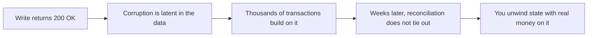

This is a fair question, and the honest answer starts by agreeing. Postgres is an excellent foundation for a ledger. Kordio runs on Postgres. So this page is not "avoid Postgres". It is about what you are actually signing up to build when you decide to roll your own ledger on top of it, and why that is more than it looks.

The trap is treating a ledger as a schema problem: a couple of tables and some constraints. It is not. A correct ledger is a distributed correctness system, and the failure mode when you get it wrong is the worst kind. It does not crash. It returns success and silently corrupts money, and you find out weeks later when the numbers do not add up.

## The breaking point: when Postgres stops being enough

A single row updated under one transaction with a `CHECK` constraint is genuinely safe. Postgres handles that perfectly, and you do not need a ledger for it.

Correctness stops being a property of one transaction the moment money moves between more than one place.

<Info>
  **Stop hand-rolling ledger logic on Postgres the moment money moves between more than one account or crosses a system boundary (a retry, an external system, a cached balance).** Before that, a table and a `CHECK` constraint are genuinely enough. After it, correctness lives across transactions, across processes, and across time, which is exactly where a single database transaction stops protecting you.
</Info>

This is the inflection point engineers look for, and it arrives earlier than most expect: the first time you have two accounts, or the first time a client can retry a request. After that, "we will add a real ledger later" means shipping on top of a foundation that can already corrupt itself.

## ACID is not a financial correctness system

**ACID guarantees are necessary but not sufficient for financial correctness.** They protect a single transaction. They do not protect a ledger.

The strongest objection to this page is true: Postgres gives you ACID, plus constraints, plus careful design. You should use all of it. But ACID's scope is one database transaction, and financial correctness lives in the gaps ACID was never meant to cover.

- **Across transactions over time.** ACID makes each write atomic. It does not make a sequence of writes economically coherent. That a reversal exactly offsets its original, that a closed period stays closed, that a refund never exceeds what was captured: these are invariants over the history, not properties of one row update.
- **Across retries and external systems.** A client sends a request, the network times out after the row commits but before the response, and the client retries. ACID has no idea those two HTTP calls are the same intent. Deduplication across that boundary is yours to build: idempotency keys, a uniqueness guarantee, and a replay path that returns the original.
- **Across derived state.** A cached balance and the postings it summarizes are two representations of the same fact. ACID keeps one transaction internally consistent. It does not keep a materialized total in sync with the rows beneath it as both evolve.
- **Across concurrency on business rules.** Isolation stops dirty reads. It does not stop a "check the balance, then post" sequence from racing two concurrent debits that each saw enough funds. Preventing that is concurrency control you design, not a flag you set.

So ACID is not the financial correctness system. It is the primitive you then have to build the financial correctness system on top of. The work is the part ACID does not do for you.

## What eventually breaks when money scales

These are not risks you might hit. Under load they are scheduled events. The concurrency you never reproduce at ten writes a second arrives on its own at a thousand, and the retry your tests never fired, a flaky network fires a hundred times a day. It is a question of throughput and time, not luck. And every one of these failures returns `200 OK` at the moment it happens.

- **A retry duplicates a charge.** The insert commits, the response is lost, the client retries. With no idempotency key enforced by a unique index, the same economic event is recorded twice. The customer is debited twice and you hear about it from support.
- **Concurrent writes drive a balance negative.** Two requests debit one account at once. Each reads a sufficient balance, each passes the non-negative check, both commit. The account goes negative. A `CHECK` on a stored balance column would only catch it by reintroducing a stored balance that can drift; the correct fix is serializing writes per account, which is a concurrency-control system, not a constraint.
- **A partial failure leaves the ledger unbalanced.** A write lands some postings and then the process dies, or one code path inserts a posting outside the surrounding transaction. Debits and credits no longer match. Conservation is broken and the gap is permanent.
- **A race creates phantom funds.** Operations across accounts interleave in an order no one intended, and value appears that was never deposited. These are the worst bugs: nondeterministic, timing-dependent, and invisible to a single-threaded test.
- **A reconciliation mismatch surfaces weeks later.** None of the above fails loudly. The system keeps returning success while the corruption sits in the data, and thousands of later transactions build on the bad state before anyone compares totals against a bank or a processor and finds they do not agree.

The throughline is silence. A ledger built wrong does not page you. It keeps working, and the cost compounds with every transaction written on top of the corruption.

## What you are actually signing up to build

Said plainly: not a schema, a distributed correctness system that holds money invariants across retries, concurrency, external systems, derived state, and time. Each piece below is one part of that system, and getting any single one wrong silently corrupts money.

- Balanced-per-currency enforcement, deferred to `COMMIT` so multi-posting writes check as a whole.
- Append-only history with the economic columns frozen, so the past cannot be rewritten.
- Idempotency that survives concurrent identical requests across the network boundary.
- Atomic multi-posting writes that roll back entirely on any failure.
- Per-account serialization so balance-dependent decisions cannot race.
- Derived balances that stay fast without becoming a second source of truth.
- Multi-currency with an FX snapshot recorded at write time, a stable API and error contract, webhooks and a replayable events tail, value-date point-in-time history, and reconciliation against external systems.

Every hour spent building and maintaining that system is an hour not spent on your product, and the ledger is rarely your differentiator.

## Where Kordio fits

Kordio is that correctness system, offered as an API. The [invariants](/invariants) are enforced for you in application code and in Postgres triggers, idempotency holds across the network boundary, writes are serialized per account, balances are derived, and multi-currency, point-in-time history, and reconciliation are built in. You write the business logic, and the ledger cannot enter an impossible state.

<CardGroup cols={2}>
  <Card title="Invariants" icon="shield-check" href="/invariants">
    The states the ledger makes impossible.
  </Card>
  <Card title="Where Kordio fits" icon="map" href="/positioning">
    The category and where you arrive at the need.
  </Card>
  <Card title="Reconciliation" icon="scale-balanced" href="/reconciliation">
    Where silent corruption would otherwise surface.
  </Card>
  <Card title="Quickstart" icon="rocket" href="/quickstart">
    From credentials to a posted transaction in four calls.
  </Card>
</CardGroup>
